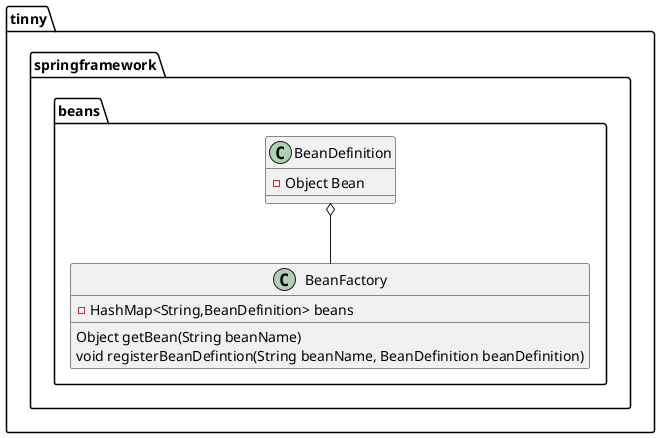
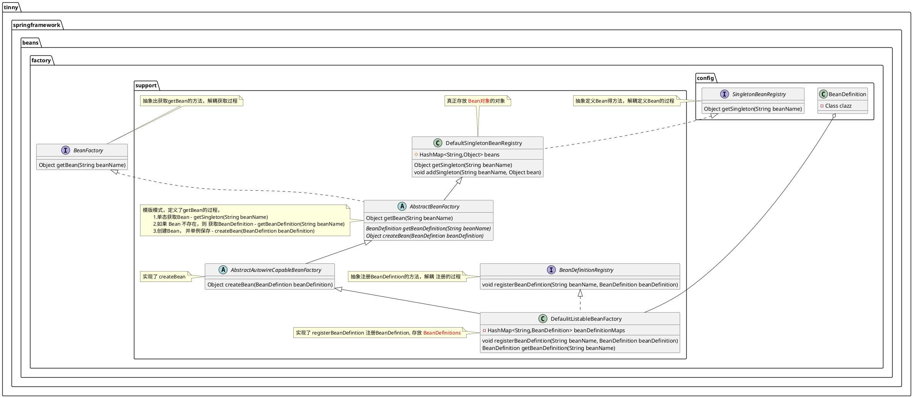
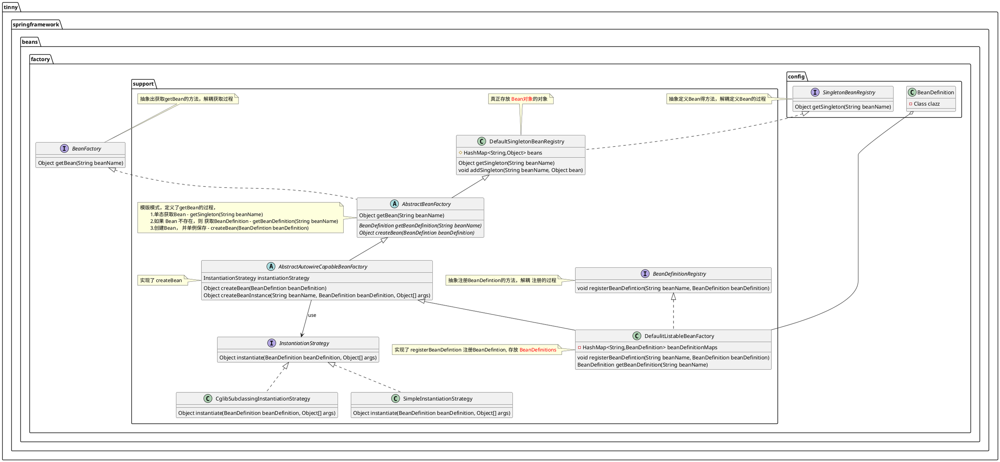
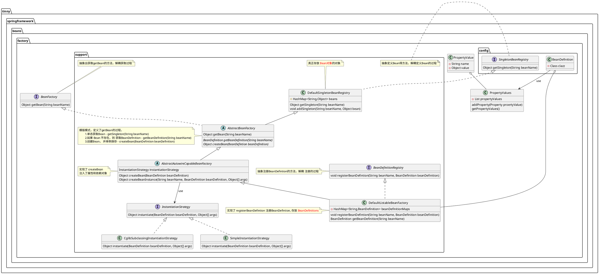

# 需求1. 02
1. 希望有一个对象，可以保存已经常见的对象，并且可以复用

## 方案


## Bean
```java
public class UserService {  
    public void queryUserInfo(){  
        System.out.println("query user info");  
    }  
}
```


## 使用Bean Factory
```java
BeanDefinition beanDefinition = new BeanDefinition(new UserService());
BeanFactory beanFactory = new BeanFactoru();
beanFactory.registerBeanDefinition("userService Bean",beanDefinition);
UserService userService = beanFactory.getBean("userService Bean"); # 获取生成的Bean对象
userService.queryInfo():
```
# 需求2. 03
1. BeanDefinition 期望不要保存已经实例的对象，只需保存期望对象的Class
2. 期望已单态模式添加的Bean对象，但未来不排除可能会希望每次多是新的实例对象
## 方案
1. 抽象 BeanDefinition 注册过程 - BeanDefinitionRegistry
2. 抽象 Bean的 添加过程 - SingletonBeanRegistry
3. 抽象 Bean的 获取过程 - BeanFactory



## Bean
```java
public class UserService {  
    public void queryUserInfo(){  
        System.out.println("query user info");  
    }  
}
```

## 使用Bean Factory

```java
BeanDefinition beanDefinition = new BeanDefinition(UserService.class);  
  
DefaultListableBeanFactory beanFactory = new DefaultListableBeanFactory();  
beanFactory.registerBeanDefinition("UserService", beanDefinition);  
UserService userService = (UserService) beanFactory.getBean("UserService");  
userService.queryUserInfo();
```


# 需求3.  04
1. Bean对象带有构造函数
2. 实例化策略可能选择JDK本身的方式，也可以选择Cglib




# 需求4. 05
1. 增加Bean对象的属性定义
	- 原生类型
	- 引用对象

