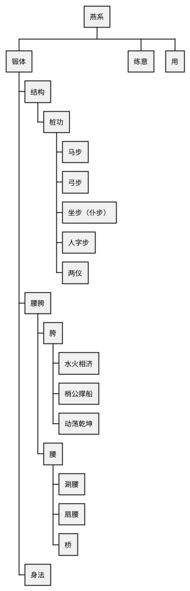

```plantuml
@startwbs
* 燕系
** 锻体
*** 结构
**** 桩功
***** 马步
***** 弓步
***** 坐步（仆步）
***** 人字步
***** 两仪
*** 腰胯
**** 胯
***** 水火相济
***** 梢公撑船
***** 动荡乾坤
**** 腰
***** 涮腰
***** 扇腰
***** 桥
*** 身法
** 练意
** 用
@endwbs
```
