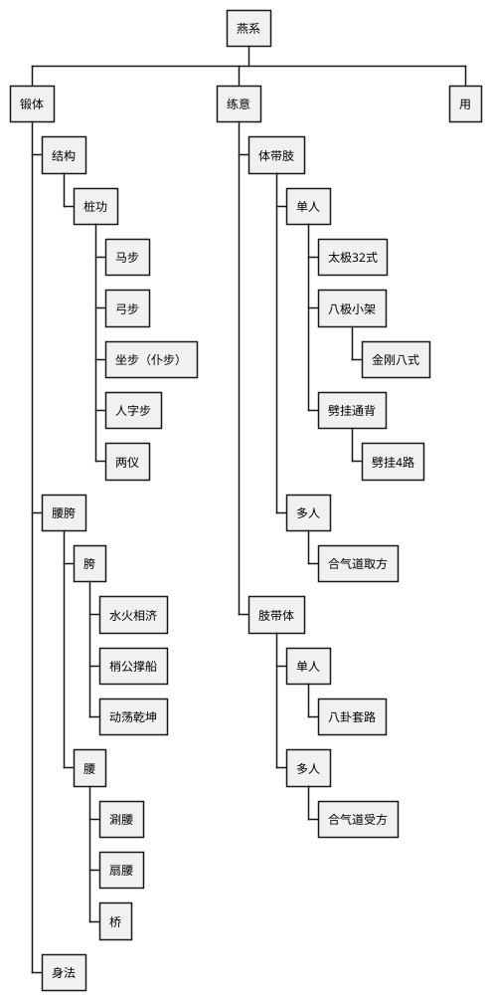

```plantuml
@startwbs
* 燕系
** 锻体
*** 结构
**** 桩功
***** 马步
***** 弓步
***** 坐步（仆步）
***** 人字步
***** 两仪
*** 腰胯
**** 胯
***** 水火相济
***** 梢公撑船
***** 动荡乾坤
**** 腰
***** 涮腰
***** 扇腰
***** 桥
*** 身法
** 练意
*** 体带肢
**** 单人
***** 太极32式
***** 八极小架
****** 金刚八式
***** 劈挂通背
****** 劈挂4路
**** 多人
***** 合气道取方
*** 肢带体
**** 单人
***** 八卦套路
**** 多人
***** 合气道受方
** 用
@endwbs
```
