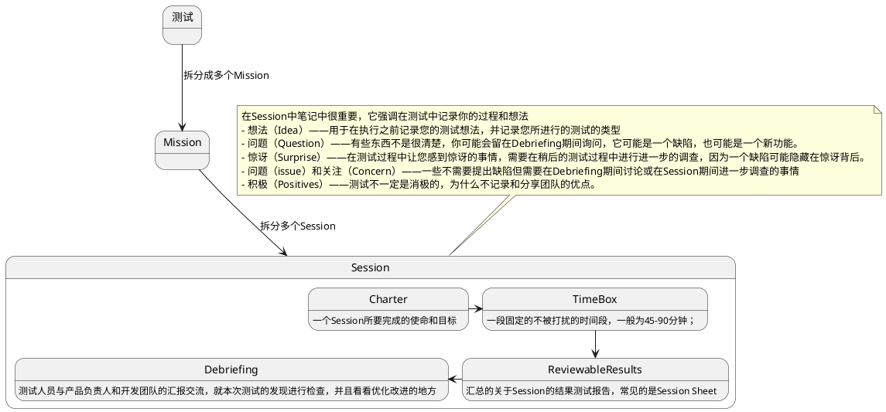

---
tags:
  - 测试
  - 探索式测试
description: 探索式测试的一种管理方式
---
SBTM=Session-based test management会话式测试管理（简称SBTM）。它是一种[灵活的](https://so.csdn.net/so/search?q=%E7%81%B5%E6%B4%BB%E7%9A%84&spm=1001.2101.3001.7020)测试方法，强调测试人员的自主性和测试的探索性质。

一个简报的范例
![[Pasted image 20240307172551.png]]

[参考](https://blog.csdn.net/tester_sc/article/details/106654681?spm=1001.2101.3001.6650.7&utm_medium=distribute.pc_relevant.none-task-blog-2%7Edefault%7EBlogCommendFromBaidu%7ERate-7-106654681-blog-133688305.235%5Ev43%5Econtrol&depth_1-utm_source=distribute.pc_relevant.none-task-blog-2%7Edefault%7EBlogCommendFromBaidu%7ERate-7-106654681-blog-133688305.235%5Ev43%5Econtrol&utm_relevant_index=14)