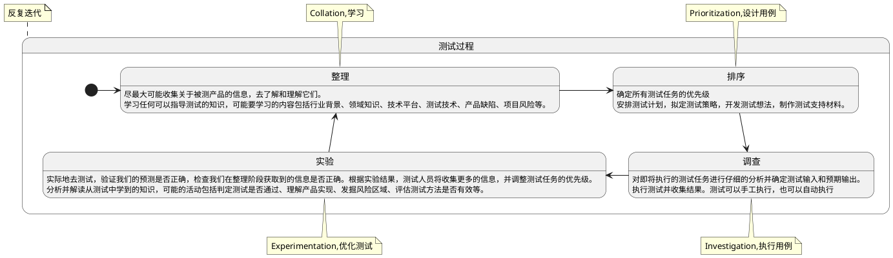

---
tags:
  - 测试
  - 探索式测试
description: 探索式测试思维模型
---

```plantuml
@startuml
state 测试过程{
[*] -right-> 整理
整理 -right-> 排序
整理:尽最大可能收集关于被测产品的信息，去了解和理解它们。
整理:学习任何可以指导测试的知识，可能要学习的内容包括行业背景、领域知识、技术平台、测试技术、产品缺陷、项目风险等。
排序 --> 调查
排序:确定所有测试任务的优先级
排序:安排测试计划，拟定测试策略，开发测试想法，制作测试支持材料。
调查 -left-> 实验
调查:对即将执行的测试任务进行仔细的分析并确定测试输入和预期输出。
调查:执行测试并收集结果。测试可以手工执行，也可以自动执行
实验 -up->整理
实验:实际地去测试，验证我们的预测是否正确，检查我们在整理阶段获取到的信息是否正确。根据实验结果，测试人员将收集更多的信息，并调整测试任务的优先级。
实验:分析并解读从测试中学到的知识，可能的活动包括判定测试是否通过、理解产品实现、发掘风险区域、评估测试方法是否有效等。
}
note top of 测试过程:反复迭代
note top of 整理: Collation,学习
note top of 排序: Prioritization,设计用例
note bottom of 调查: Investigation,执行用例
note bottom of 实验: Experimentation,优化测试
@enduml
```

