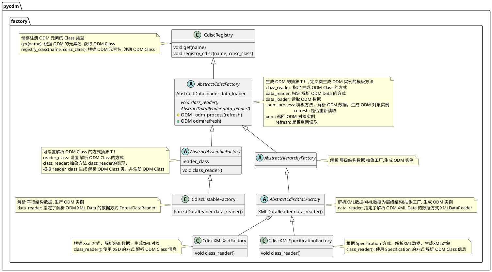
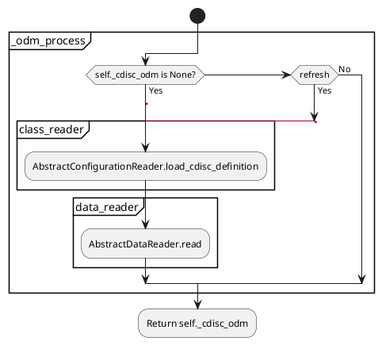
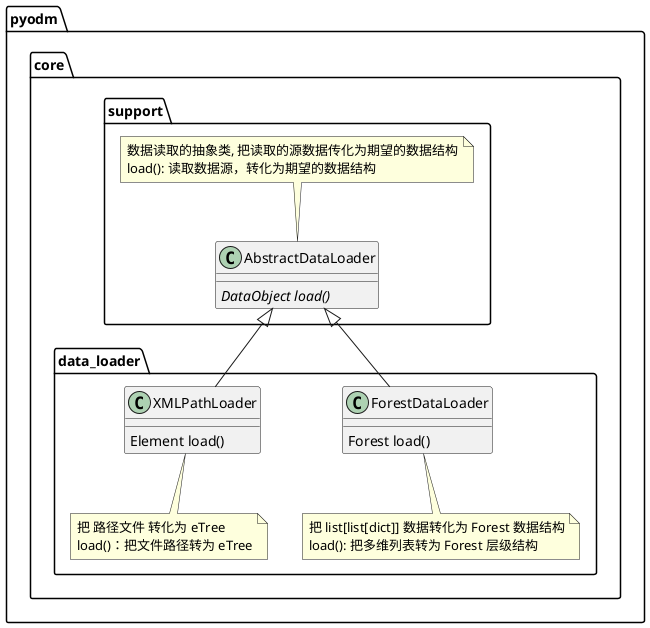
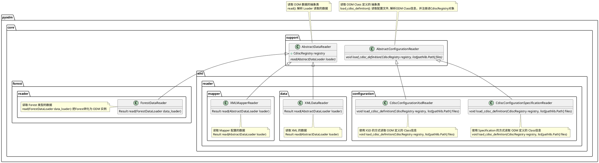
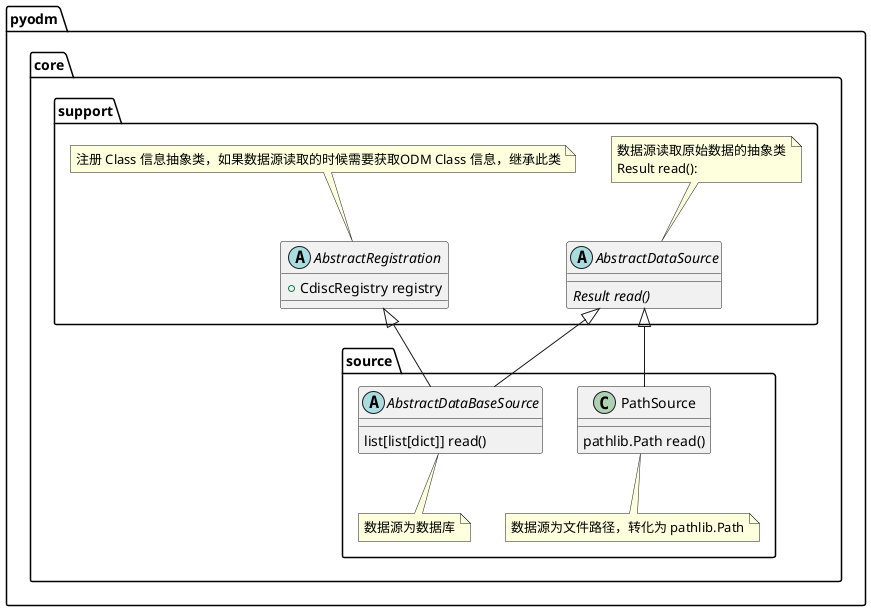
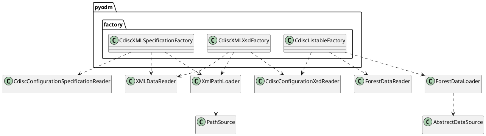

# ODM Class
ODM Class的定义是根据 [ODM V2](https://wiki.cdisc.org/display/ODM2/ODM+v2.0)
## ODM Class 定义方式
### 1. 静态方式(Specification)
 - step1. 定义 ODM Class的代码文件
 - step2. 定义 ODM 元素和ODM Class的映射文件
[示例](https://github.com/thcpc/pyodm/tree/master/example/custom_odm_factory)

### 2. 动态方式(Xsd)
 - step1. 定义 XSD 文件
 - Factory 调用时会动态生成
 
## 成员变量
成员变量主要有三种类型
- Attribute
- OneElement
- ManyElements
### Attribute()
#### 定义
定义改成员变量为属性
![[Pasted image 20231121102155.png]]
#### API
| Name | 成员类型 | 含义 |
| --- | ----- | ---- |
| name | property | Attribute 名 |
| value | property | Attribute 的值 |

### OneElement()
#### 定义
定义该成员变量为 该子元素只有一个
![[Pasted image 20231124143755.png]]
- ? (meaning optional, with zero or one occurrence)
#### API
| Name | 成员类型 | 含义 |
| --- | ----- | ---- |
| name | property | Element 名 |
| value | property | 如果 Element 有文本值 |
| is_blank | method | 返回该元素是否有文本 |
### ManyElements()
#### 定义
定义该成员变量的子元素可能有多个
![[Pasted image 20231124143855.png]]
- * (meaning optional, with zero or more occurrences)
- + (meaning required, with one or more occurrences)
#### API
| Name | 成员类型 | 参数 |含义 |
| --- | ----- | ---- | --- |
| name | property | 无 |Element 名 |
| value | property | 无 |如果 Element 有文本值 |
| array | property| 无 |返回该元素的列表|
| count | property| 无 | 元素个数 |
| index| method | int i |返回 指定位置的元素 |
| first| method | 无 | 返回 第一个元素 |
| find | method | \*\*attributes | 返回符合属性的第一个 | 

# 主要的功能类说明

## Factory



### odm_process 方法流程图


## Loader


## Reader


## Source


## 依赖关系



# 应用场景
## 读取标准的 ODM data 的XML文件
[示例数据 Example1 ](https://wiki.cdisc.org/display/ODM2/ItemGroupData)
- [CdiscXsdFactory](https://github.com/thcpc/pyodm/tree/master/example/xsd_factory)
- [CdiscSpecificationFactory](https://github.com/thcpc/pyodm/tree/master/example/specification_factory)

## 数据库中读取数据，并生成XML文件
[CdiscListableFactory](https://github.com/thcpc/pyodm/tree/master/example/database)
## 自定义结构，并读取 XML 数据
[示例](https://github.com/thcpc/pyodm/tree/master/example/custom_odm_factory)

### Step2. 定义 ODM 对象的配置的XML文件
```xml
<?xml version="1.0" encoding="UTF-8"?>
<CDISC>
    <ODM modulePath="pyodm.model.v2.cdisc.ODM" clazz="ODM"/>
    <AuditRecord modulePath="pyodm.model.v2.cdisc.AuditRecord" clazz="AuditRecord"/>
    <ClinicalData modulePath="pyodm.model.v2.cdisc.ClinicalData" clazz="ClinicalData"/>
    <DateTimeStamp modulePath="pyodm.model.v2.cdisc.DateTimeStamp" clazz="DateTimeStamp"/>
    <ItemData modulePath="pyodm.model.v2.cdisc.ItemData" clazz="ItemData"/>
    <ItemGroupData modulePath="pyodm.model.v2.cdisc.ItemGroupData" clazz="ItemGroupData"/>
</CDISC>
```

#### modulePath
class 的 package 路径
#### clazz
class 名

### Step3. CdiscSpecificationFactory 加载ODM
[[pyodm#CdiscSpecificationFactory 生成 ODM 对象| CdiscSpecificationFactory]]
